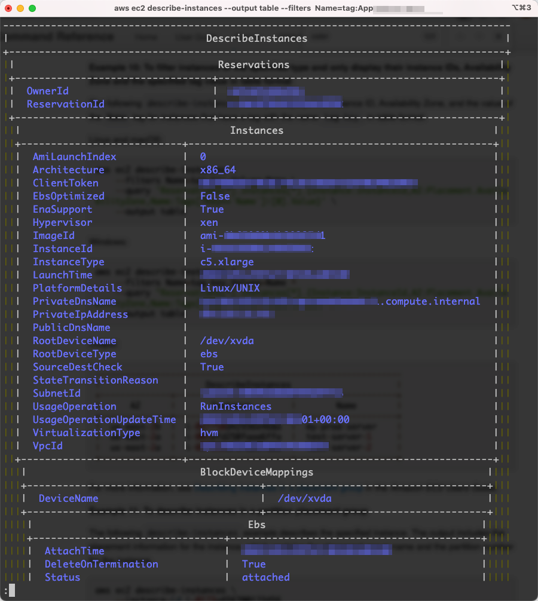

## aws configure
```bash
# aws cli related environement variables
export AWS_PROFILE=
export AWS_ACCESS_KEY_ID=
export AWS_SECRET_ACCESS_KEY=
export AWS_SESSION_TOKEN=
export AWS_REGION=ap-southeast-1

export AWS_DEFAULT_OUTPUT=json
export AWS_DEFAULT_REGION=ap-southeast-1
```

## cli output filtering

For basic syntax, please refer to 
https://docs.aws.amazon.com/cli/latest/userguide/cli-usage-filter.html

This article only share some practical examples.

### server side filtering with option --filter

Server-side filtering in the AWS CLI is provided by the AWS service API. The AWS service only returns the records in the HTTP response that match your filter, which can speed up HTTP response times for large data sets. Since server-side filtering is defined by the service API, the parameter names and functions vary between services.

**Notice:**
* --filter and --filters does not support regular expressions. 
* --filter-expression does support expression, but only a few aws service support this option

```bash

```

### client side filtering with optioin --query

The AWS CLI provides built-in JSON-based client-side filtering capabilities with the --query parameter. The --query parameter is a powerful tool you can use to customize the content and style of your output. The --query parameter takes the HTTP response that comes back from the server and filters the results before displaying them. Since the entire HTTP response is sent to the client before filtering, client-side filtering can be slower than server-side filtering for large data-sets.

```bash

```

### Client Side Filtering with jq

```bash

```

## aws sts
```bash
# get current identity
aws sts get-caller-identity
```

```bash
# assume role and set credentials to env variables, with jq
ROLE_ARN=arn:aws:iam::000000000000:role/your-role
eval $(aws sts assume-role \
        --role-arn ${ROLE_ARN} \
        --role-session-name sess-name \
        | jq -r '.Credentials | "export AWS_ACCESS_KEY_ID=\(.AccessKeyId) AWS_SECRET_ACCESS_KEY=\(.SecretAccessKey) AWS_SESSION_TOKEN=\(.SessionToken)"'
      )
```

```bash
# assume role and set credentials to env variables, with sed & awk
ROLE_ARN=arn:aws:iam::000000000000:role/your-role
eval $(aws sts assume-role \
        --role-arn ${ROLE_ARN} \
        --role-session-name sess-name \ 
        | egrep '(SecretAccessKey|SessionToken|AccessKeyId)' \
        | awk -F'"' '{print "export AWS"toupper(gensub(/([A-Z])/, "_\\1", "g",$2))"="$4}'
      )
```

## aws ec2

```bash
# find ec2 with --filters
aws ec2 describe-instances \
    --filters Name=instance-type,Values=t2.micro,t3.micro 
              Name=availability-zone,Values=us-east-2c
```

```bash
# find ec2 with --filters by tag
aws ec2 describe-instances \
    --filters Name=tag:Owner,Values=my-team
```

```bash
# find ec2 with --filters by tag
aws ec2 describe-instances \
    --filters "Name=tag:Owner,Values=my-team"
```

```bash
# get only useful information of ec2 instances wich both --filters and --query
aws ec2 describe-instances \
    --filters "Name=tag:Owner,Values=my-team"
    --query 'Reservations[*].Instances[*].{Instance:InstanceId, Name:Tags[?Key==`Name`]|[0].Value}'
```

```bash
# --output table makes outputs more human readable.

```


```bash
# login to ec2 shell via session manager
aws ssm start-session --target i-aaaaaaaaaaaaaaaaaa
```

```bash
# port-forward
```

## aws s3
```bash
# list bucket
aws s3 ls
```

```bash
# rename folder
aws s3 --recursive mv s3://your-bucket/path/to/foo s3://your-bucket/path/to/bar
```

## aws eks

```bash
# check web identity
env | grep AWS_
```

## cloudfront

```bash
# list distributions with id, aliases, domian name and origin
aws cloudfront list-distributions | jq  '.DistributionList.Items[] | {"Id": .Id, "Aliases": .Aliases.Items, "Domain": .DomainName, "Origin": .Origins.Items[0].DomainName}'
```

```bash
# create an invalidation, clear cache
aws cloudfront create-invalidation distribution-id
```